# Cipherfell — The Warden's Eye

> A cozy medieval-village mystery RPG that teaches **cybersecurity mental models** without a single computer on screen. No hoodies, no neon, no "matrix" text rain. You learn to *think* like a security practitioner by walking a village, gathering clues, and solving seven interlocking mysteries.

**▶ Play it now: [https://cipherfell.pages.dev](https://cipherfell.pages.dev)**

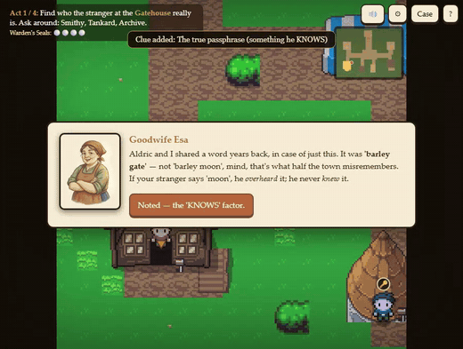

*Browser-native. Nothing to install. Works on desktop and mobile, with keyboard, touch joystick, or gamepad.*

---

## Why this exists

Most cybersecurity teaching leans on the same sci-fi clichés: a hooded hacker, green code raining down, "firewalls" drawn as literal walls. Those images teach aesthetics, not understanding.

The real core of security is not technology. It is a handful of transferable **mental models**:

- **Authentication** — "is this person really who they claim to be?"
- **Confidentiality / encryption** — "can I move a secret past a hostile reader?"
- **Least privilege / threat modeling** — "who can touch what, and how bad is it if they turn?"
- **Information leakage / OSINT** — "harmless public scraps, combined, become a secret."
- **Social engineering / phishing** — "a message cannot authenticate itself; verify an unexpected, high-pressure order out-of-band."
- **Integrity / hashing** — "don't just hide data; make tampering detectable by recomputing a checksum and comparing."
- **Availability / backups** — "keep redundant copies in separate places so loss, fire, or ransomware can't deny access."

Set those in a 13th-century walled village and the player practices the *reasoning*, not the jargon. By the end they have never touched a machine, yet they have rehearsed the exact judgment a security professional uses every day. The transfer to real-world security is made explicit in the epilogue and is mapped to recognized curriculum standards below.

---

## The story

You arrive in **Cipherfell** as its newly appointed **Warden of the Seal**, the officer who vouches for who-is-who and keeps the Duke's correspondence safe. The **Baron of Thornmoor** covets the village; having lost it once at law, his line swore to take by cunning what it could not win by right. By night his agents slip through the gate wearing borrowed names and forged seals. The Duke gives you one rule:

> **"Trust nothing you cannot prove."**

Within a day, seven troubles strike at once, and they are connected:

1. A **stranger at the gate** claims to be Aldric, the merchant gone three winters to the city.
2. The Duke's **sealed order** arrives already opened, read by a spy.
3. Grain vanishes from a **locked granary** whose keys have quietly multiplied.
4. The rival **Baron always knows** the village's plans a day early.
5. A **forged summons** in the Duke's own name orders the night watch to abandon the gate.
6. The **village ledger** balances perfectly, yet the stolen grain has left no trace in it.
7. Cornered, the Baron threatens to **burn the village records** and ransom what survives.

Solve all seven, earn the seven Warden's Seals, and the single hand behind them is exposed.

---

## Screenshots

| | |
|---|---|
| 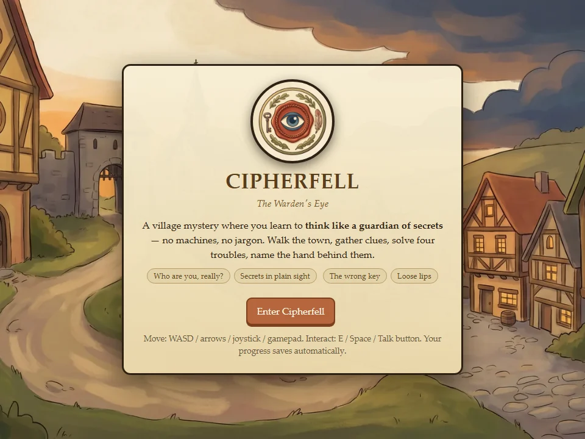 | 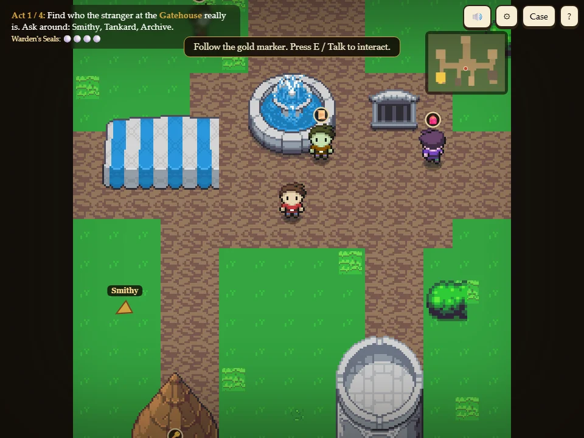 |
| **Hand-painted title** over an AI-illustrated village | **Pixel-art town** with mini-map, objective waypoint, and signposted buildings |
| 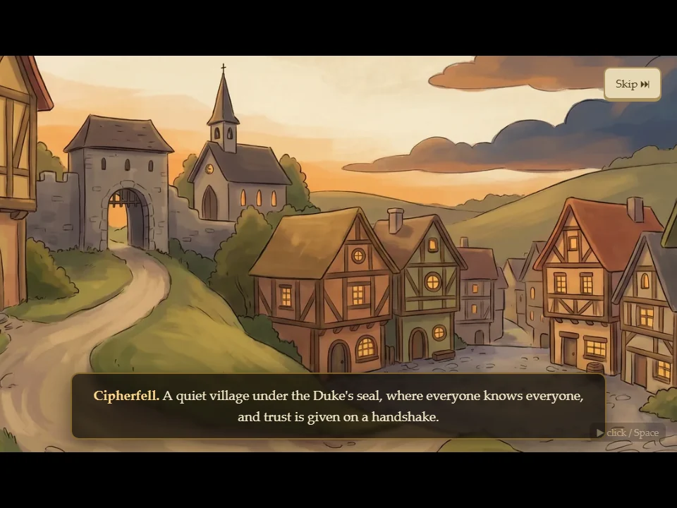 | 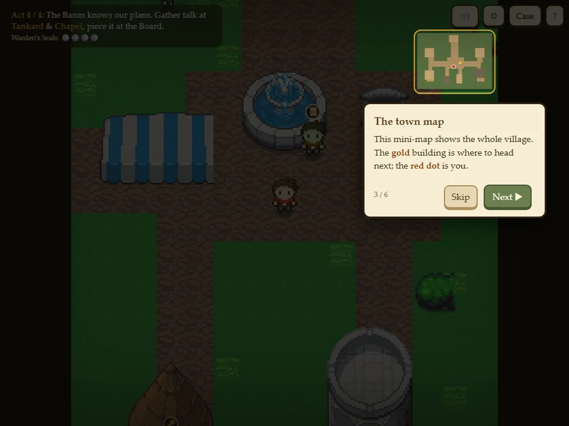 |
| **Cinematic narrative** introduces the Baron and the stakes | **Spotlight tutorial** briefs the mission step by step |
| 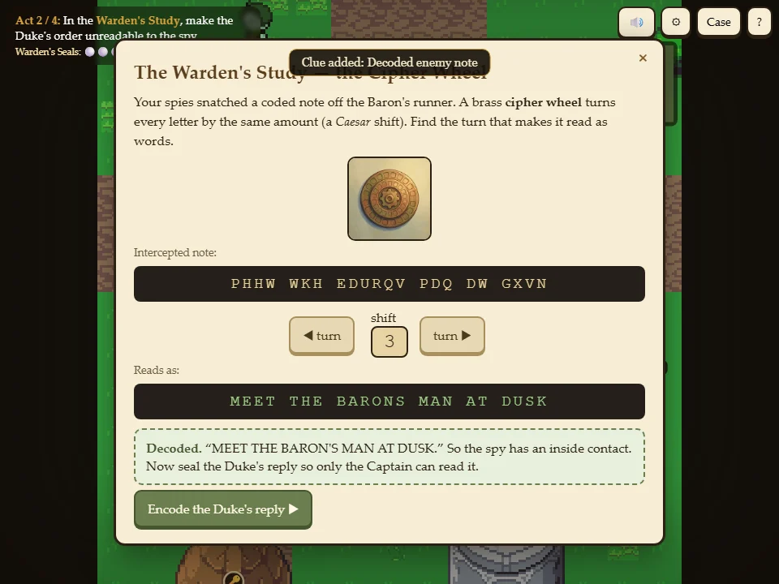 | 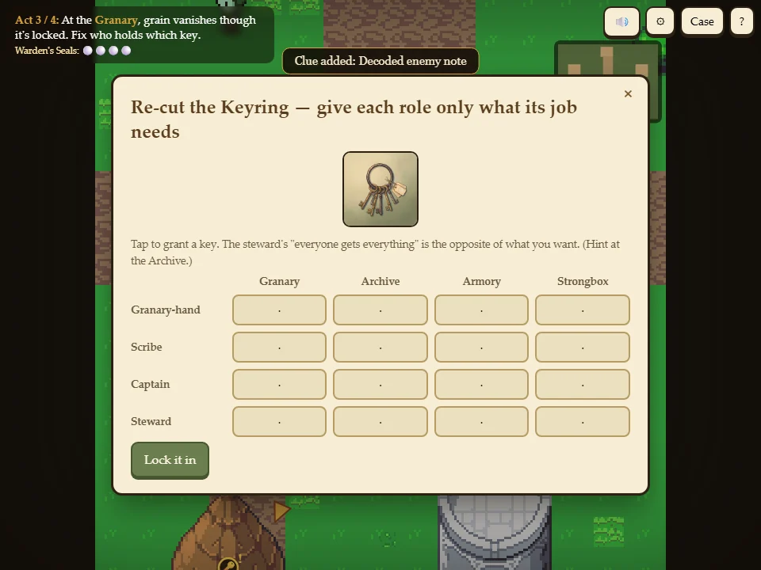 |
| **Caesar cipher wheel** (encryption / key management) | **Least-privilege keyring** (access control) |
| 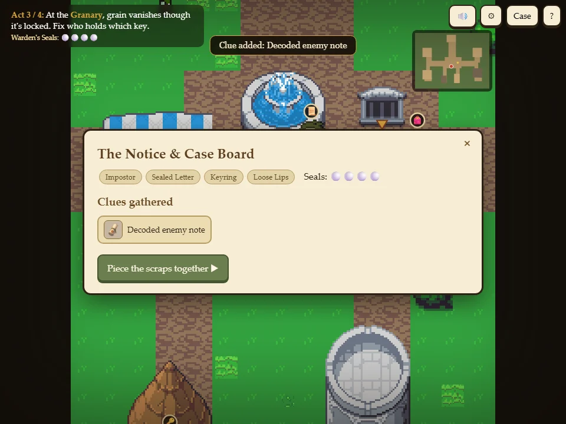 | 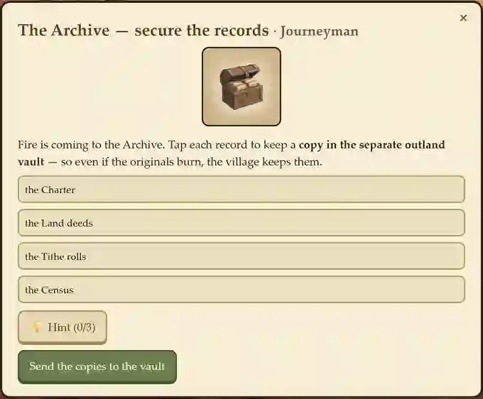 |
| **Case board** aggregates clues toward the final deduction | **Records backup drill** (availability) — copy every record off-site before the fire |

## Screencast / trailer

- **Gameplay screencast (28s):** [docs/media/gameplay_screencast.mp4](docs/media/gameplay_screencast.mp4)
- **Narrated 1-minute trailer (grandfather storyteller voiceover):** [docs/media/cipherfell_trailer.mp4](docs/media/cipherfell_trailer.mp4)
- **Learning-support video (~1:45, narrated walkthrough of the hardest puzzles):** [docs/media/cipherfell_learning_support.mp4](docs/media/cipherfell_learning_support.mp4) — how to think through the cipher wheel, the least-privilege keyring, OSINT aggregation, and the tampered-ledger checksum, without giving the answers away.

---

## Features

- **Seven-act gated investigation.** Each act unlocks the next via a Warden's Seal, so the story escalates instead of dumping everything at once.
- **Real exploration.** Walk a scrolling, tiled medieval town (40 x 30 tiles) with a follow-camera, collision, cobbled roads, a market square, a north watchtower, a counting house, a lore-bearing Founders' Stone, and signposted landmarks.
- **Multi-step mysteries.** A puzzle opens only after you travel the town and gather the right clues, so the RPG loop (move, talk, collect, deduce) drives the learning.
- **Animated characters.** Four-direction walking sprites for the player and fifteen NPCs (recolored from CC0 sheets, two body types) each tagged with a role badge so they are easy to tell apart.
- **Hand-authored puzzles**, one per concept: an MFA verification cross-examination, an interactive Caesar cipher wheel, a least-privilege key grid plus culprit deduction, an OSINT aggregation board, a forged-summons pretext analysis (spot the manipulation levers, then verify out-of-band), a ledger re-tally that exposes a tampered figure by recomputing its seal, and a records-backup drill that forces off-site copies before fire and ransomware strike.
- **Cinematic layer.** A six-card opening sequence, one-card act-transition beats featuring the villain, and a finale, all with typed narration, letterboxing, and fades.
- **Worldview and lore.** A bard who recounts the Cipherfell–Thornmoor feud and a readable Founders' Stone inscribed with seven vows, one per quest, ground the mechanics in a coherent setting.
- **Adaptive difficulty (Elo + ZPD).** Four difficulty tiers per puzzle (Novice→Master) with seeded per-play variation; a per-concept + global Elo model tunes each act to the learner's level and persists across plays.
- **Layered learning support.** Graduated hints that auto-surface on a stall or repeated misses, diagnostic wrong-answer feedback, Novice-tier worked examples, an end-of-game mastery profile, and an optional keyless AI tutor (Workers AI, EN/KO) with scripted fallback.
- **Research instrumentation.** An optional, anonymous consent gate enables a pre/post knowledge check (drawn from a **21-item bank, 3 per concept**, with parallel pre/post forms), misconception-targeted feedback, lightweight in-browser telemetry, a difficulty-calibration monitor, and a one-click CSV export — turning the game into a self-contained study instrument with no backend.
- **Mission briefing + spotlight tutorial.** A guided onboarding that dims the screen and highlights each UI element (quest bar, mini-map, journal) with an explanation. Replayable from Help.
- **Navigation aids.** Live mini-map (gold = current objective) and an on-screen/edge objective waypoint, so players never get lost.
- **Game feel.** Footstep dust, clue and seal sparkle particles, and synthesized sound effects.
- **Audio.** CC0 background music with a settings panel (volume slider, mute) that persists.
- **Save and score.** Progress autosaves to `localStorage`; an endgame "Warden's rating" reflects how few hints and missteps you needed.
- **Accessibility.** Physical key codes (works on non-Latin keyboards), touch and gamepad first-class, responsive square viewport, all player-facing strings externalized.
- **Single file, $0 stack.** One `index.html` with no build step, no server, and no API keys. Deployed on Cloudflare Pages.

---

## The seven lessons → cybersecurity concepts

| Act | In the village | The security idea |
|---|---|---|
| **1. The Impostor at the Gate** | Prove the stranger is or is not the real Aldric using something he *knows* (a passphrase), *has* (a signet), and *is* (a scar the smith recognizes). The impostor passes the stealable factors and fails the unforgeable one. | **Authentication and multi-factor authentication (MFA).** Identity rests on independent factors; attackers target the weakest single one. The "verify, do not assume" stance is the seed of **zero trust**. |
| **2. The Sealed Letter** | Decode an intercepted note on a brass cipher wheel, then encode the Duke's reply. Discover a runner who wrote the key on the same parchment as the message. | **Encryption, confidentiality, and key management.** Secrecy lives in the *key*, not in hiding the method (**Kerckhoffs's principle**). Never ship the key with the ciphertext; key handling is the whole game. |
| **3. The Keyring** | The steward gave everyone the master key "for convenience." Re-cut the keyring to the minimum each role needs, then deduce who stole grain from a now-singular access set. | **Least privilege, separation of duties, and threat modeling.** Grant minimum access, revoke stale access, shrink the blast radius. Over-broad permissions make it impossible even to reason about who could have done it. |
| **4. Loose Lips** | No one leaked a secret, but the tavern's shipment day plus the laundry list plus the ledger plus the chapel bell, combined, reveal a precise raid window. Plug the aggregate, not the people. | **Information leakage, OSINT, and OPSEC.** Public + public + public can equal private. Attackers aggregate open scraps (open-source intelligence). Defend the *pattern*, practice operational security and data minimization. |
| **5. The Forged Summons** | A letter in the Duke's name orders the watch off the gate at midnight. Spot the four pretext levers (borrowed authority, manufactured urgency, enforced secrecy, a protocol-breaking request), then refuse to obey and confirm the order through a channel you already trust. | **Social engineering and phishing.** Attackers forge authority and manufacture urgency to make you act before you think. A message cannot authenticate itself; verify unexpected, high-pressure requests **out-of-band**. The pretext levers map directly to phishing red flags. |
| **6. The Tampered Ledger** | The accounts balance, yet the stolen grain left no trace. Each ledger page carries a wax tally seal (a checksum of its figures). Re-tally every page and find the one whose sealed number no longer matches its true sum — the doctored entry. | **Integrity, checksums, and hashing.** Don't keep the data secret — make tampering *detectable*. A checksum (or cryptographic hash) over the content changes if even one figure changes; recompute and compare to a trusted value. This is how file hashes, digital signatures, and tamper-evident logs work. |
| **7. The Burned Records** | The Baron will burn the Archive and ransom what survives. Copy every critical record to a separate vault first; when the fire comes, restore from the backups instead of paying. | **Availability, redundancy, and backups (and ransomware).** The third pillar of the **CIA triad**. Keep redundant copies in *separate* places so loss, fire, or ransomware can't deny access; with good backups you restore instead of paying (3-2-1: several copies, different media, off-site). |
| **Capstone** | Tie each finding to the clue that proves it, then name the one suspect consistent with all seven threads (a forged identity, access to the letters, an old master-key copy, a week of tavern gossip, a summons forged in the Duke's name, a doctored ledger, and an attempt to burn the records). | **Synthesis, evidence reasoning, and adversarial thinking.** Match evidence to claims, correlate weak signals into a single attribution; think like the attacker to defend. |

### See each mental model in play

| | |
|:---:|:---:|
| 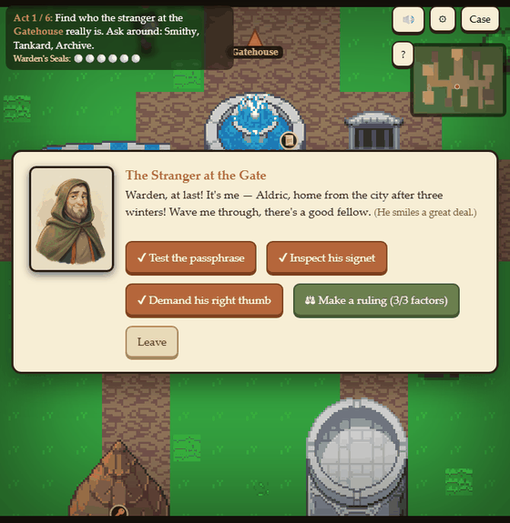 | 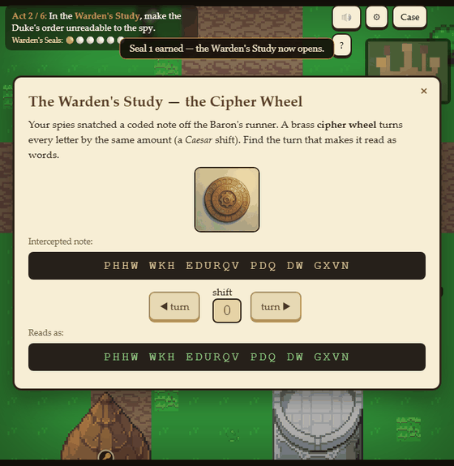 |
| **1. Authentication / MFA** — cross-examine the impostor on what he *knows*, *has*, and *is*. | **2. Encryption / key management** — turn the Caesar wheel until the intercepted note reads as words. |
| 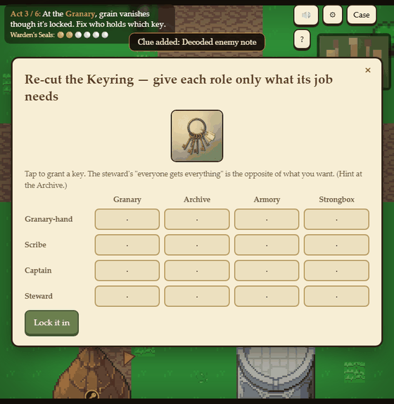 | 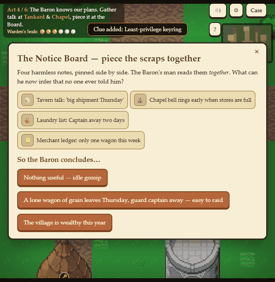 |
| **3. Least privilege** — re-cut the keyring so each role holds only its own door. | **4. OSINT / OPSEC** — aggregate harmless public scraps into a precise raid window. |
| 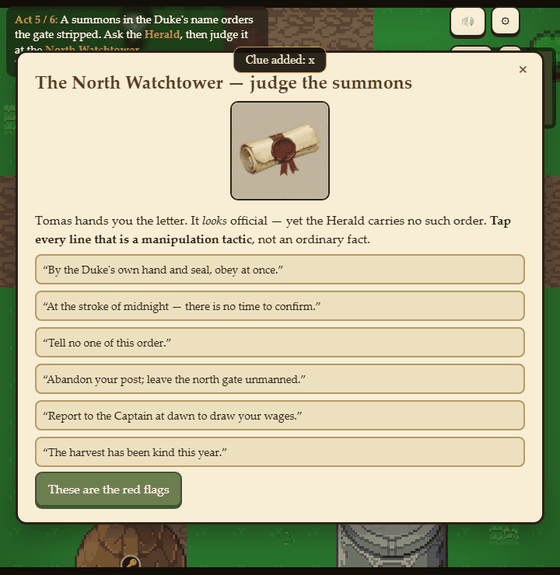 | 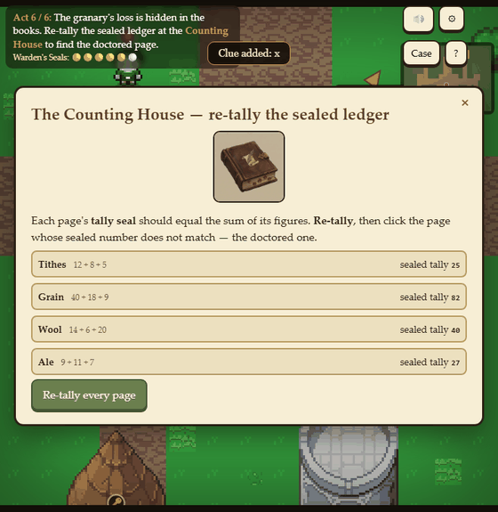 |
| **5. Social engineering** — spot the pretext levers in a forged summons, then verify out-of-band. | **6. Integrity / hashing** — re-tally each ledger page to expose the doctored figure. |
| 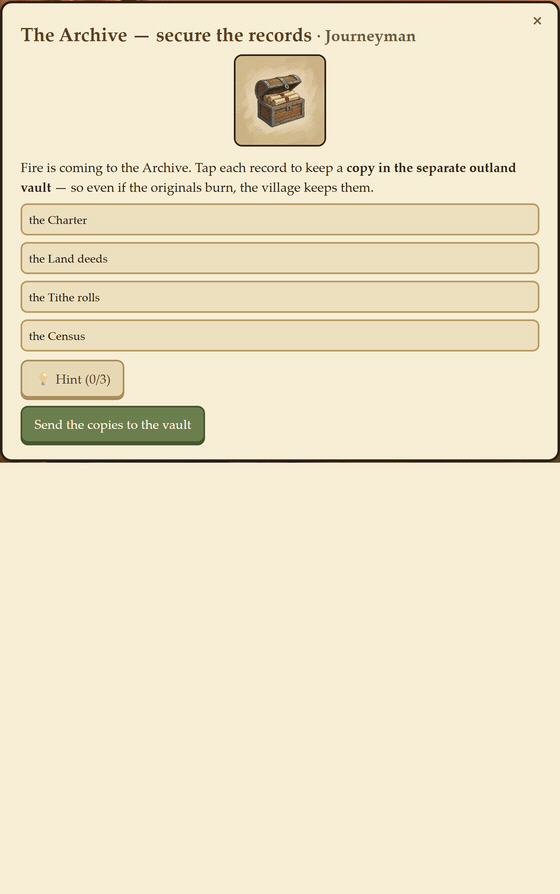 | |
| **7. Availability / backups** — copy every record off-site before the fire, then restore instead of paying the ransom. | |

---

## Mapping to cybersecurity education curriculum standards

Cipherfell is designed as an *introduction-level* learning object: a hook that builds intuition before formal vocabulary. Each act aligns to recognized frameworks. Codes are indicative of the area addressed, not a claim of full coverage.

### By framework

**CSEC2017 — Cybersecurity Curricula 2017 (ACM/IEEE-CS/AIS/IFIP), 8 Knowledge Areas**

| Act | Primary KA(s) | Crosscutting concept |
|---|---|---|
| 1. Impostor | Human Security (Identity Management); System Security (Authentication) | Confidentiality, Integrity, Adversarial Thinking |
| 2. Sealed Letter | Data Security (Cryptography, Cryptanalysis, Key Management); Connection Security (secure transmission) | Confidentiality |
| 3. Keyring | System Security (Access Control); Organizational Security (Risk Management, Governance) | Risk, Systems Thinking |
| 4. Loose Lips | Societal Security (Privacy, Cyber Ethics); Human Security (Awareness); Organizational Security (OPSEC) | Confidentiality, Risk |
| 5. Forged Summons | Human Security (Social Engineering, Awareness and Understanding, Cyber Hygiene); System Security (verification) | Adversarial Thinking, Integrity |
| 6. Tampered Ledger | Data Security (Data Integrity, Cryptographic hashing, Digital signatures, Message authentication) | **Integrity**, Adversarial Thinking |
| 7. Burned Records | Organizational Security (Business Continuity, Disaster Recovery, Backups); System Security (Availability) | **Availability**, Risk |
| Capstone | Crosscutting: **Adversarial Thinking**, Systems Thinking | CIA triad, Defense in Depth |

**NIST Cybersecurity Framework (CSF) 2.0 — Functions and Categories**

| Act | Function | Representative category |
|---|---|---|
| 1. Impostor | Protect | PR.AA — Identity Management, Authentication, and Access Control |
| 2. Sealed Letter | Protect | PR.DS — Data Security (data-in-transit confidentiality) |
| 3. Keyring | Protect / Identify | PR.AA-05 least privilege; ID.AM Asset Management; ID.RA Risk Assessment |
| 4. Loose Lips | Identify / Protect / Govern | ID.RA threat intelligence; PR.AT Awareness and Training; GV privacy |
| 5. Forged Summons | Protect / Detect | PR.AT Awareness and Training (social-engineering resistance); DE.CM monitoring/verification of anomalous requests |
| 6. Tampered Ledger | Detect / Protect | DE.CM-01 integrity monitoring; PR.DS-06 integrity-checking mechanisms (checksums, hashes, signatures) |
| 7. Burned Records | Recover / Protect | RC.RP Recovery Plan execution; PR.DS-11 backups / data resilience |

**Other mappings**

| Act | NICE Framework (SP 800-181r1) | CISSP domain | CompTIA Security+ (SY0-701) |
|---|---|---|---|
| 1. Impostor | Identity Management; Authentication | D5 Identity and Access Management | 1.2 Zero Trust; 4.6 IAM/MFA |
| 2. Sealed Letter | Data Security; Cryptography knowledge | D3 Security Architecture and Engineering | 1.4 Cryptographic solutions |
| 3. Keyring | Access controls; Risk Management | D3 Security models; D7 Security Operations (need-to-know, privileged access) | 1.1 Least privilege; 4.6 Access control; 5.x Governance/Risk |
| 4. Loose Lips | Threat Analysis; Privacy | D1 Security and Risk Management (OPSEC, privacy) | 2.1 Threat actors and OSINT recon; 5.x Privacy |
| 5. Forged Summons | Recognizing social engineering; Security awareness | D1 Security and Risk Management (security awareness training); D5 (out-of-band verification) | 2.2 Social engineering (pretexting, phishing, urgency/authority); 5.6 Security awareness |
| 6. Tampered Ledger | Data integrity; Cryptography (hashing) | D3 Security Architecture (integrity models); D8 Software Dev Security (integrity checks) | 1.4 Cryptographic solutions (hashing, digital signatures); 2.x Integrity / tamper detection |
| 7. Burned Records | Incident Response; Continuity | D1 Security & Risk Management (BCP/DR); D7 Security Operations (backup & recovery) | 3.4 Resilience & recovery (backups); 2.5 Ransomware mitigation |

**K-12 alignment**

- **CYBER.ORG K-12 Cybersecurity Learning Standards** — Security principles (authentication and access control, least privilege, defense in depth), Data (encryption, **data integrity**), Impacts (digital footprint and privacy), and social-engineering / phishing awareness.
- **CSTA K-12 CS Standards** — 3A-NI-05 (recommend security measures), 3A-NI-06 (encryption to secure data), 2-NI-05 / 3A-IC-29/30 (social engineering, safe practices, social/legal/ethical/privacy impacts); data integrity / checksums support 3B-NI-04-style integrity reasoning.
- **AP Computer Science Principles** — Big Idea 5, Impact of Computing (safe computing, security, privacy, phishing/social engineering); Big Idea 2, Data (integrity and fidelity).

### Learning objectives (Bloom's)

After playing, a learner can:

- **Explain** the three authentication factor types and **argue** why multiple independent factors resist impersonation (Understand, Evaluate).
- **Apply** a substitution cipher and **justify** why confidentiality depends on key secrecy and key handling, not on hiding the algorithm (Apply, Analyze).
- **Design** a least-privilege access assignment and **reason** about blast radius and revocation when attributing an insider action (Create, Analyze).
- **Infer** what an outside observer can deduce by aggregating public information, and **recommend** OPSEC mitigations (Analyze, Evaluate).
- **Identify** the levers of a social-engineering pretext (authority, urgency, secrecy, protocol-breaking) and **decide** to verify a suspicious order through an independent channel (Analyze, Evaluate).
- **Detect** tampering by recomputing a checksum and comparing it to a trusted value, and **explain** how integrity differs from confidentiality (Apply, Understand).
- **Plan** redundant, off-site backups and **justify** restoring over paying a ransom, completing the CIA triad with availability (Create, Evaluate).
- **Adopt** an adversarial, "verify, do not assume" mindset as a default stance (the affective goal).

### Suggested use

- **Audience:** upper-elementary through high school, introductory undergraduate, and corporate security-awareness onboarding.
- **Session:** roughly 20 minutes for a full play-through; suitable as a lesson hook, a flipped-classroom pre-activity, or an awareness-week installation.
- **Debrief:** the epilogue restates each village lesson with its real security name. Pair it with a discussion that names the framework terms (MFA, Kerckhoffs, least privilege, OSINT/OPSEC, social engineering / phishing, integrity / hashing, availability / backups, the CIA triad, zero trust).
- **Research use:** an optional consent gate enables a built-in pre/post knowledge check (seven items) and anonymous telemetry, exportable as CSV — usable as a self-contained usability/learning-effect study instrument.
- **Educator guide:** a full PD guide for K-12 and higher-ed instructors (lesson cards, debrief prompts, standards crosswalk, an AI-literacy bridge, and a data/assessment walkthrough) is in **[docs/EDUCATOR_GUIDE.md](docs/EDUCATOR_GUIDE.md)**.

---

## Adaptive learning & research instrumentation

Cipherfell is also an evidence-grounded **adaptive learning instrument**. The design follows the research frontier on adaptive educational games: dynamic difficulty adjustment (DDA), Elo-based learner modeling, and Evidence-Centered Design / stealth assessment kept inside the learner's Zone of Proximal Development (ZPD) / flow band.

**Adaptive difficulty (Elo + ZPD).** Each of the seven puzzles is parameterized into four tiers — *Novice / Apprentice / Journeyman / Master* — and a seeded RNG varies the specific instance every play (cipher text & shift, keyring grid size, OSINT options, summons lines, ledger figures & tampered page, records to back up). A lightweight **Elo** model tracks a global ability and a per-concept ability; after each puzzle it updates on the **binary clean-solve** signal (no hints, no missteps = standard, drift-free Elo). The next act's tier is chosen so the predicted success probability sits near the ZPD target (~0.7). Ability **persists across plays** (localStorage), so returning learners are met at their level (act 1 adapts from history); a fresh learner starts at Novice/Apprentice and ramps up. The four-tier range was set by Monte-Carlo so weak and strong learners both stay in the ZPD band.

**Layered learning support (scaffolding).** Each puzzle offers graduated, three-step hints; if a learner stalls (~18 s) or misses twice, support **auto-surfaces** (Shute-style proactive scaffolding) without a click. Wrong answers get **specific, diagnostic feedback** (e.g. the exact role→door errors in the keyring), and the Novice tier adds a brief **worked example**. An optional **keyless AI tutor** (Cloudflare Workers AI, English & Korean, graceful fallback to scripted hints) gives concept-aware formative nudges that never reveal the answer.

**Mastery feedback.** The epilogue shows a per-concept **mastery profile** (ability → %) across the seven competencies and flags the weakest for revisiting.

**Telemetry & calibration.** With consent, the game logs consent, pre/post answers, clue pickups, seals, hints (manual and auto), and adaptive events, each timestamped. A one-click **CSV export** includes the per-play seed, per-act tiers, global and per-concept ability, and a **calibration block** (mean predicted P vs. actual clean-solve rate vs. the ZPD target) so the difficulty model can be validated empirically across participants. Monte-Carlo simulation was used to verify the Elo update converges (no θ drift) and to keep achieved success within a healthy ZPD band.

**Localization.** A KO/EN toggle (Settings) localizes the comprehension- and research-critical surfaces (UI, objectives, cinematics, consent, knowledge checks, epilogue), with English fallback for untranslated strings.

---

## Tech stack and architecture

- **One self-contained `index.html`** — HTML/CSS plus a vanilla-JS canvas engine. No framework, no build, no bundler.
- **Rendering:** a tile-grid town drawn from 16 px CC0 stamps at 3x, a follow-camera with AABB collision, four-direction sprite animation, a depth-sorted entity pass, and a particle system.
- **Systems:** dialogue with portraits, a quest/act state machine with seal gating, puzzle modals, a case-board journal, a fade-transition and cinematic engine, a WebAudio sound manager, a mini-map and waypoint, a spotlight tutorial, a seeded-Elo adaptive engine, an i18n layer, and a telemetry/CSV layer.
- **Persistence:** `localStorage` autosave (position, seals, clues, quest flags, settings) plus cross-play adaptive ability (`cf_theta`/`cf_thetaG`).
- **AI tutor backend:** optional `_worker.js` (Cloudflare Pages advanced mode) exposing a keyless `/api/tutor` over Workers AI (`AI` binding) with a HuggingFace fallback; the client degrades to scripted hints when absent.
- **Deploy:** Cloudflare Pages (`dist/`); `wrangler.toml` declares the Workers AI binding.

### Run locally

```bash
git clone https://github.com/Educatian/cipherfell.git
cd cipherfell
python -m http.server 8000
# open http://localhost:8000
```

Any static file server works. There is no build step.

---

## Assets and credits

Cipherfell deliberately mixes two coherent layers: a **pixel-art world** and **hand-painted story art** for dialogue and cinematics (a long-standing JRPG convention).

- **Pixel world and character sprites:** "Zelda-like Tilesets and Sprites" by **ArMM1998** — CC0 1.0 (Public Domain). [OpenGameArt](https://opengameart.org/content/zelda-like-tilesets-and-sprites). Also evaluated: Kenney "Tiny Town" (CC0) and Pixel-Boy "Ninja Adventure" (CC0).
- **Music:** "Ninja Adventure" pack by **Pixel-Boy and AAA** — CC0 1.0. [itch.io](https://pixel-boy.itch.io/ninja-adventure-asset-pack). Re-encoded to 96k Ogg.
- **Sound effects:** synthesized in-browser via WebAudio (no external assets).
- **Story illustrations and dialogue portraits:** generated with a single consistent hand-painted style formula, then optimized to WebP. The grandfather voiceover in the trailer was produced with ElevenLabs.

Per-asset license notes live in `assets/world/CREDITS.txt` and `assets/audio/CREDITS.txt`.

## License

- **Code:** MIT (see `LICENSE`).
- **Third-party assets:** under their respective licenses, credited above (CC0 for world art and music).

## Acknowledgments

Built as part of an evidence-grounded educational-game line: design a target construct, ground it in the real security literature, realize it as a concrete mechanic, then make the transfer explicit. Cipherfell's thesis is simple: you can teach the security mindset with a story, a village, and a careful eye, long before anyone opens a terminal.
