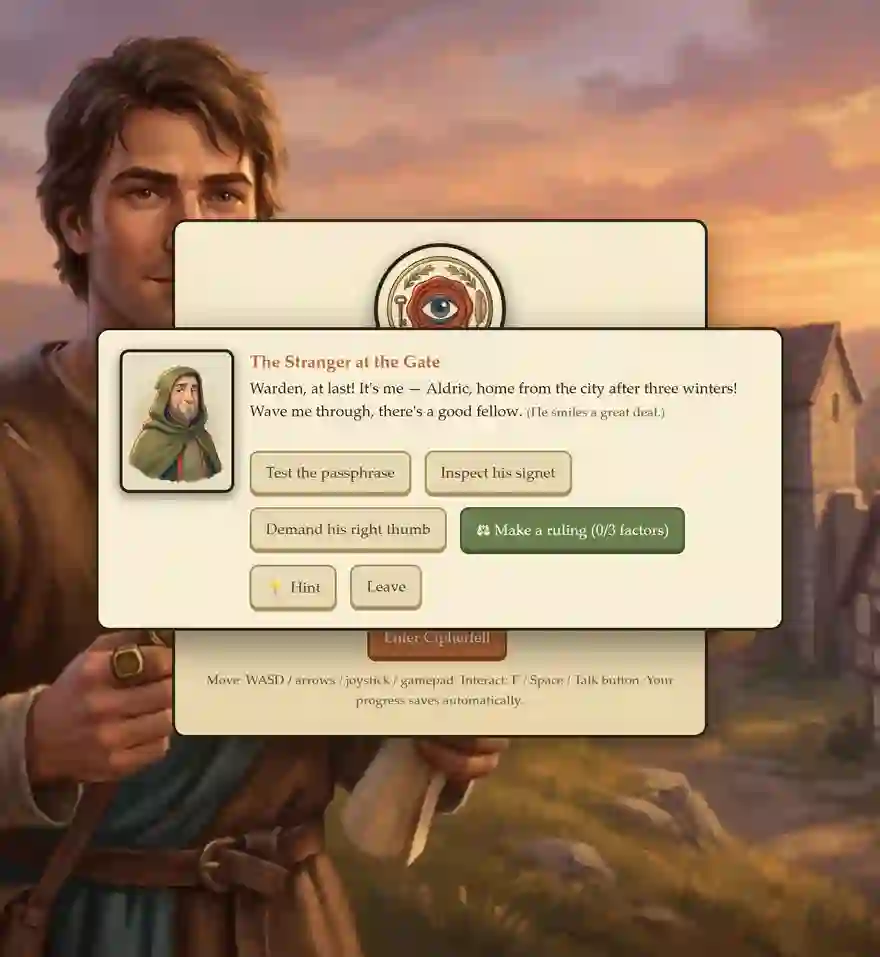
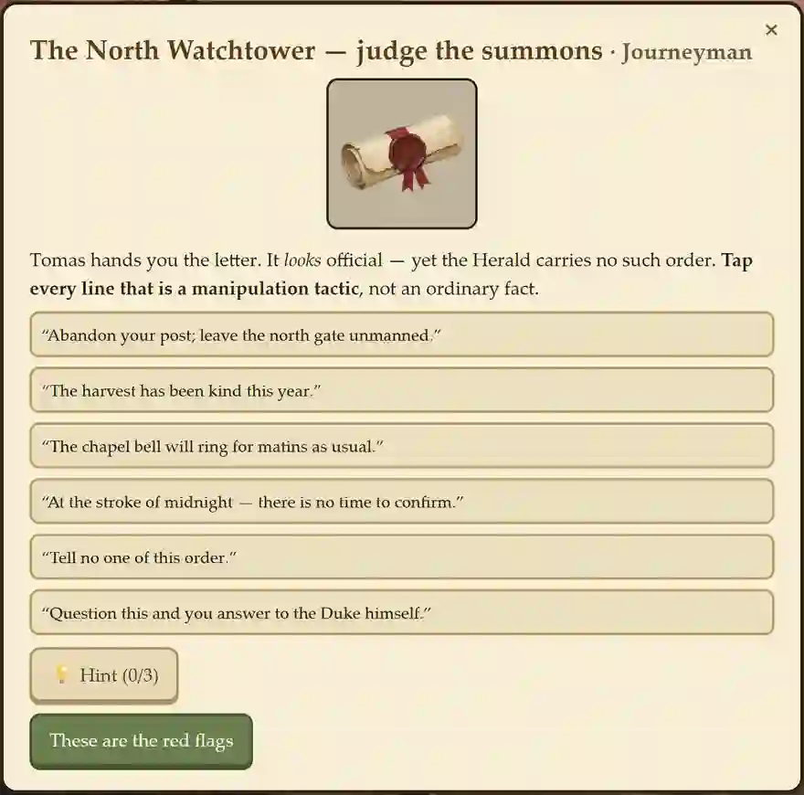
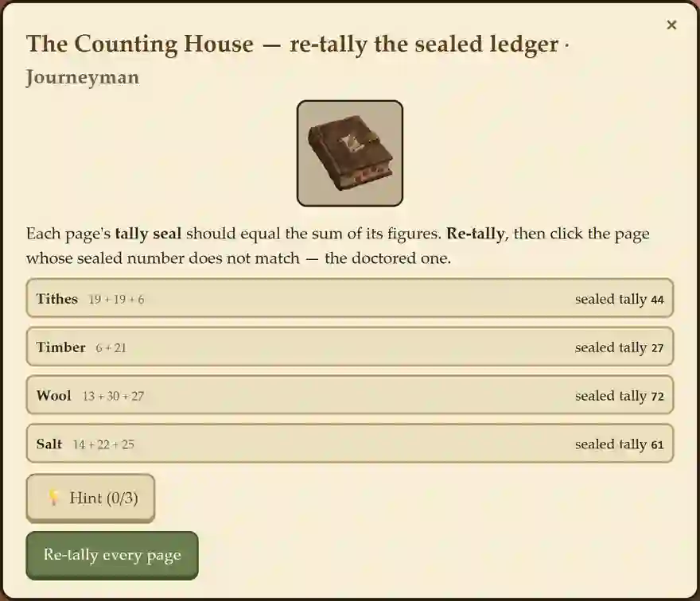
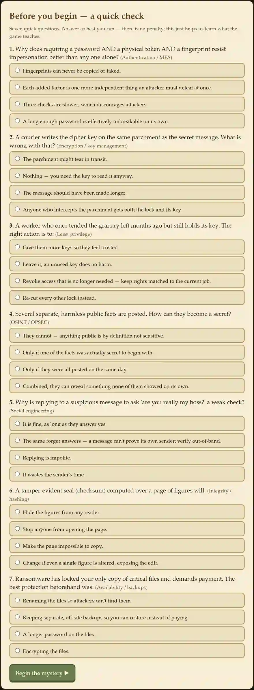
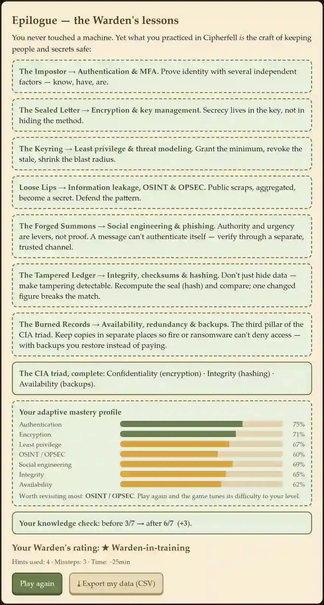

# Cipherfell — Educator Guide

**Teaching cybersecurity mental models (and AI literacy) with a browser RPG.**
Play it free, no install, no accounts: **https://cipherfell.pages.dev**

This guide is for K-12 (middle/high) and higher-ed instructors — including
non-specialists. You do not need a security background to run it; Part A gives you
everything you need. It is built on a scan of leading AI-/digital-literacy PD kits
(AI4K12, Experience AI, Day of AI, UNESCO, EDUCAUSE) and the serious-game
facilitation literature, where the learning is consolidated in the **debrief**, not
the play. Every lesson card is therefore **pre-brief → play → debrief → check → extend**.

> **Two tracks.** Throughout, **[K-12]** marks middle/high-school notes and **[HE]**
> marks higher-ed / faculty-development notes. The core is shared.

---

## 0. Start here (one page)

- **What it is.** A medieval-village mystery where the player learns to *think like a guardian of secrets* — no machines, no jargon. Seven "troubles" each teach one security mental model; solving all seven names the culprit.
- **Time.** ~8-12 min per act; ~60-90 min for all seven; the optional pre/post adds ~10 min.
- **Devices.** Any modern browser (laptop, Chromebook, tablet). Works offline once loaded. Saves locally.
- **Languages.** English and Korean (toggle in-game).
- **Data.** Anonymous and local by default. A consent gate turns on an optional pre/post quiz + a one-click CSV export for the teacher — nothing leaves the browser unless *you* export it (see Part D).
- **The seven troubles → ideas.** Impostor at the Gate → **authentication/MFA**; Sealed Letter → **encryption**; Keyring → **least privilege**; Loose Lips → **OSINT/OPSEC**; Forged Summons → **social engineering**; Tampered Ledger → **integrity/hashing**; Burned Records → **availability/backups**. Together they complete the **CIA triad** (confidentiality, integrity, availability).

| The village to explore | The mission briefing / tutorial |
|:---:|:---:|
|  |  |

---

# Part A — Orientation (read this first)

## A1. Why this matters: cybersecurity *as* AI literacy

Security thinking is increasingly inseparable from AI literacy. The same mental
models Cipherfell teaches are exactly the ones a person needs to reason about the
risks of modern AI systems. AI literacy is now a defined competency set for both
students and teachers (Casal-Otero et al., 2023, *AI literacy in K-12: a systematic
literature review*; Ng et al., 2023, *Teachers' AI digital competencies*), and its
"societal impact / ethics" strand — AI4K12's **Big Idea 5**, EDUCAUSE's **Ethical
Considerations**, UNESCO's **human-centered values** — is where Cipherfell lives.

The bridge is concrete, not decorative. Each act maps to a contemporary,
**research-documented** AI risk:

| Act (security model) | The AI-era version of the threat | Verified anchor |
|---|---|---|
| 1 Authentication / MFA | AI face/voice **spoofing** of biometric factors | Korshunov & Marcel (2018), *DeepFakes: a New Threat to Face Recognition?* (arXiv:1812.08685) |
| 2 Encryption / keys | who can read the data flowing through AI pipelines; secret/key leakage | (key-management principle; see Act 2) |
| 3 Least privilege | scoping what AI **agents/tools** are allowed to do (excessive agency) | OWASP *Top 10 for LLM Applications* (LLM01 Prompt Injection, LLM06 Excessive Agency) |
| 4 OSINT / OPSEC | AI **inference** from public data; re-identification; training-data leakage | Shokri et al. (2017), *Membership Inference Attacks Against ML Models*, IEEE S&P (doi:10.1109/sp.2017.41) |
| 5 Social engineering | **AI-generated** phishing, voice clones, deepfake pretexts | Heiding et al. (2024), *Devising and Detecting Phishing Emails Using LLMs*, IEEE Access (doi:10.1109/access.2024.3375882) |
| 6 Integrity / hashing | detecting **deepfaked / tampered** media; output integrity | Tolosana et al. (2020), *Deepfakes and beyond*, Information Fusion (doi:10.1016/j.inffus.2020.06.014) |
| 7 Availability / backups | resilience against AI-accelerated **ransomware** | Razaulla et al. (2023), *The Age of Ransomware*, IEEE Access (doi:10.1109/access.2023.3268535) |

Use this table as your throughline: teach the timeless mental model in the village,
then in the debrief, surface its AI-era form.

> **[K-12]** Frame as "how to not get fooled — by people *or* by AI." **[HE]** Frame as
> the security/ethics competency inside your AICFT/EDUCAUSE AI-literacy outcomes.

## A2. The seven mental models in plain language (facilitator background)

You can run every act knowing only this.

1. **Authentication / MFA.** Identity rests on independent factors — something you *know* (a password), *have* (a token), *are* (a fingerprint). Attackers beat the weakest single one; requiring several, especially an unforgeable one, is the defense. *Misconception to surface:* "a strong password is enough."
2. **Encryption / key management.** Secrecy lives in the **key**, not in hiding the method (Kerckhoffs's principle). Never ship the key with the message. *Misconception:* "hiding how the lock works keeps it safe" (security by obscurity).
3. **Least privilege.** Give each role only the access its job needs; revoke stale access. This shrinks the "blast radius" and even makes a theft *investigable*. *Misconception:* "give everyone everything, for convenience."
4. **OSINT / OPSEC.** Public + public + public can equal private: harmless facts **aggregate** into a secret. Defend the pattern, minimize what you share. *Misconception:* "anything public is by definition harmless."
5. **Social engineering.** Attackers forge **authority** and manufacture **urgency** and **secrecy** to make you act before you think. A message can't authenticate itself — verify unexpected, high-pressure requests **out-of-band**. *Misconception:* "replying to ask 'is this really you?' is a valid check."
6. **Integrity / hashing.** Don't keep the data secret — make tampering **detectable**. A checksum/hash over the content changes if even one bit changes. *Misconception:* "if the file still opens, it wasn't altered."
7. **Availability / backups.** Keep redundant copies in *separate* places (3-2-1: several copies, different media, off-site) so loss/fire/ransomware can't deny access. With good backups you **restore** instead of paying. *Misconception:* "one copy, well-hidden, is safe."

For the full construct → evidence → mechanic → signal mapping (with citations), see
[`research/EVIDENCE_MAP.md`](../research/EVIDENCE_MAP.md).

## A3. Standards alignment (crosswalk)

Cipherfell maps to both security curricula and AI-literacy frameworks. The full
security crosswalk (CSEC2017, NIST CSF 2.0, NICE, CISSP, CompTIA Security+, CSTA,
AP CSP, CYBER.ORG) is in the [README](../README.md#mapping-to-cybersecurity-education-curriculum-standards). For the AI-literacy framing add:

| Framework | Where Cipherfell fits |
|---|---|
| **AI4K12 — Five Big Ideas** | **Big Idea 5 (Societal Impact)** across all acts; BI-1 (Perception) for biometric spoofing (Act 1) |
| **CSTA K-12 CS Standards** | Network security, data integrity, social/ethical/privacy impacts (already mapped in README) |
| **ISTE Standards** | Digital Citizen (safe/legal/ethical practice); Knowledge Constructor (evaluate information — Acts 4, 6) |
| **UNESCO AI Competency Framework for Teachers (2024)** | "Ethics of AI" + "human-centered" aspects; runnable at the *acquisition* and *deepening* levels |
| **EDUCAUSE AI Literacy in T&L (2024)** | **Evaluative Skills** (Acts 4-6) and **Ethical Considerations** (all); role-tailored student vs. faculty outcomes |

## A4. How the adaptive engine works (and what *not* to over-coach)

Cipherfell quietly adapts difficulty. After each puzzle a lightweight **Elo** model
updates the learner's estimated ability; the next act is set to a **tier**
(Novice → Apprentice → Journeyman → Master) that keeps the predicted success rate in
the **Zone of Proximal Development** (challenging but achievable). It also **scaffolds
proactively**: a stalled learner gets a hint pulse (~18 s) and an auto-hint after a
second miss, and wrong answers get specific, diagnostic feedback. There is an optional
keyless **AI tutor** that gives concept-aware nudges without revealing the answer.

**Teaching implication:** let the system do its job. Don't rush a struggling student to
the answer — the scaffolding is timed to arrive when struggle is productive. Your value
is in the **debrief**, not in solving the puzzle for them. (Design details and the
calibration evidence: [`research/ADAPTIVE_DESIGN.md`](../research/ADAPTIVE_DESIGN.md).)

---

# Part B — Per-act lesson cards

Each card is one mini-lesson. Times assume the act plus its debrief. Run a single act
in a class period, or string several together (Part C).

### Act 1 — The Impostor at the Gate · *Authentication / MFA*

- **Pre-brief (2-3 min).** "A stranger at the gate *claims* to be the lord's man. How would you know for sure?" Collect answers; most propose one check.
- **Play (~10 min).** The student cross-examines the stranger on what he *knows*, *has*, and *is*. The impostor passes the stealable factors (passphrase, signet) but fails the unforgeable one (a scar the smith recognizes).
- **Debrief (5-8 min).** Why did one check fail? Draw out the **know/have/are** triad and "weakest single factor." *AI bridge:* if the "are" factor is a face or voice, AI can now **spoof** it (Korshunov & Marcel, 2018) — so liveness and multiple factors matter more, not less.
- **Check.** The KC item probes whether the student sees identity as *independent factors*, not a single strong secret.
- **Extend.** Audit your own accounts: which use a second factor? Which "reset" questions are guessable from your public posts?
- **Tracks.** **[K-12]** tie to phone/game-account 2FA. **[HE]** tie to passkeys, FIDO2, and biometric presentation-attack detection.

### Act 2 — The Sealed Letter · *Encryption / key management*

- **Pre-brief.** "If an enemy steals a locked message, when is the secret still safe?"
- **Play.** Turn a Caesar cipher wheel to recover the shift and read the note; discover a runner who wrote the **key on the same parchment** as the message.
- **Debrief.** Secrecy lives in the **key**, not the method (Kerckhoffs). Why is "hiding how the lock works" weak? Why never ship the key with the ciphertext? *AI bridge:* keys and secrets leak through AI pipelines and prompts; "where does the key live?" is the same question for an API key in a chatbot.
- **Check.** Does the student locate security in key separation vs. obscurity?
- **Extend.** Find one real example of "security by obscurity" failing.
- **Tracks.** **[K-12]** substitution ciphers by hand. **[HE]** symmetric vs. public-key, key rotation, secrets management.

### Act 3 — The Keyring · *Least privilege*

- **Pre-brief.** "The steward gave everyone the master key 'for convenience.' What could go wrong?"
- **Play.** Re-cut the keyring so each role holds only its own door, then deduce who stole grain from the now-singular access set.
- **Debrief.** Minimum access shrinks the blast radius — and makes the theft *investigable* (the suspect set collapses to who *could* have done it). *AI bridge:* the hottest version of this is **AI-agent permissions** — an over-permissioned agent/tool is a master key (OWASP LLM Top 10: Excessive Agency). "What can this agent actually do?" is least privilege.
- **Check.** Does the student connect scoped access to both prevention and attribution?
- **Extend.** List the permissions an app on your phone asks for; which does it actually need?
- **Tracks.** **[K-12]** "need-to-know" with classroom roles. **[HE]** RBAC, separation of duties, agent sandboxing.

### Act 4 — Loose Lips · *OSINT / OPSEC*

- **Pre-brief.** "No one leaked a secret — yet the raiders knew exactly when to strike. How?"
- **Play.** Aggregate harmless public scraps (shipment day + laundry list + ledger + chapel bell) into a precise raid window.
- **Debrief.** **Aggregation**: public + public can equal private. Defend the *pattern*; minimize what you share. *AI bridge:* AI makes aggregation cheap and scales **inference** from public traces, and models can leak their training data (Shokri et al., 2017, *Membership Inference*). Your digital exhaust is now machine-readable at scale.
- **Check.** Does the student see how independent public facts combine into something sensitive?
- **Extend.** "Self-OSINT": what could a stranger infer about your routine from your public posts?
- **Tracks.** **[K-12]** digital-footprint reflection. **[HE]** re-identification, data minimization, differential privacy at a conceptual level.

### Act 5 — The Forged Summons · *Social engineering*

- **Pre-brief.** "A letter in the Duke's name orders the watch off the gate at midnight. Do you obey?"
- **Play.** Spot the four pretext levers — **borrowed authority, manufactured urgency, enforced secrecy, a protocol-breaking request** — then verify the order through a **trusted, separate channel**.
- **Debrief.** A message can't authenticate itself; verify **out-of-band**. Why is replying to ask "is this really you?" a weak check? *AI bridge:* **LLMs now write fluent, targeted phishing and clone voices** (Heiding et al., 2024) — the grammar/typo tells are gone, so the *levers* and *out-of-band verification* are the durable defense.
- **Check.** Does the student choose trusted-channel verification over in-band reply or blind obedience?
- **Extend.** Find (or write) a phishing message and label its four levers.
- **Tracks.** **[K-12]** scam texts, "grandparent" voice scams. **[HE]** BEC, vishing, deepfake-CEO fraud, verification protocols.

### Act 6 — The Tampered Ledger · *Integrity / hashing*

- **Pre-brief.** "The accounts balance, yet grain is missing. How do you find the doctored entry?"
- **Play.** Each ledger page carries a wax tally seal (a checksum). Re-tally every page and find the one whose sealed number no longer matches its true sum.
- **Debrief.** Integrity ≠ secrecy: the goal is to make tampering **detectable**. A checksum/hash changes if any content changes. *AI bridge:* this is exactly the **deepfake / tampered-media** problem — detecting manipulated images, audio, and model outputs (Tolosana et al., 2020) — and why content provenance/signing matters.
- **Check.** Does the student recompute-and-compare rather than trust appearance ("it still opens")?
- **Extend.** Verify a file's checksum (your OS can do this); discuss what a mismatch would mean.
- **Tracks.** **[K-12]** "fingerprint of a file." **[HE]** cryptographic hashes, digital signatures, C2PA/content provenance.

### Act 7 — The Burned Records · *Availability / backups*

- **Pre-brief.** "The Baron will burn the Archive and ransom what survives. What should you have done first?"
- **Play.** Copy every critical record to a separate off-site vault, then — when the fire and ransom note come — **restore** instead of paying.
- **Debrief.** Redundant, *separate* copies (3-2-1) make loss survivable; with backups you never pay the ransom. *AI bridge:* AI is **accelerating ransomware** (Razaulla et al., 2023); resilience, not payment, is the answer.
- **Check.** Does the student choose restore-from-backup over pay/negotiate/rebuild-from-memory?
- **Extend.** What's your personal 3-2-1 plan for the files you can't lose?
- **Tracks.** **[K-12]** "where else does your homework live?" **[HE]** business continuity, RTO/RPO, immutable backups.

### Capstone — Name the Hand
After all seven, the student ties each finding to the clue that proves it and names the
single suspect consistent with all seven threads. **Debrief the *synthesis*:** correlating
weak signals into one attribution, and "thinking like the attacker to defend" — the
adversarial-thinking habit that underlies the whole CIA triad.

---

# Part C — Dosing & sequencing

Mirroring Day of AI's modular model, pick the dose that fits:

- **Single act (1 period, 45-50 min).** One pre-brief + one act + a full debrief + exit ticket. Best for dropping one idea (e.g., social engineering) into an existing unit.
- **Seven-act unit (1-2 weeks).** One act per day/session, or two per longer block; capstone on the last day. Turn on the pre/post around it (Part D).
- **Semester module.** The unit + the AI-literacy bridge expanded into discussions/assignments + a graded reflection using the mastery profile.

**Grouping.** Solo play surfaces individual reasoning (and clean telemetry); **pair/think-aloud** play surfaces the *talk* that debriefs feed on. A common pattern: solo for the pre/post-bracketed run, pairs for practice runs.

> **[K-12]** Keep to single acts or a one-week unit; lean on the in-game tutorial and hints.
> **[HE]** Run the full unit or semester module; assign the EVIDENCE_MAP and a written transfer task.

---

# Part D — Assessment & data (your "teacher console")

The serious-game literature is clear that observing gameplay data drives learning
transfer. Cipherfell gives you that without any backend.

| The pre/post knowledge check | The end-of-game mastery profile + CSV export |
|:---:|:---:|
|  |  |

- **Turn it on.** On first play the student can consent (anonymous; optional study ID). With consent, the game runs a **pre-test**, logs gameplay, and runs a **post-test**; declining changes nothing about play.
- **The knowledge check.** A **21-item bank (3 per concept)** draws one item per concept, with **parallel pre/post forms** (post asks a *different* item than pre, so gains aren't just memory). The post gives misconception-targeted feedback.
- **Export.** ⚙ Settings → *Export my data* → one CSV per student: scores + per-concept ability + per-act difficulty + a calibration block + the event log. Nothing leaves the browser until the student hands you the file.
- **Analyze a class.** Drop the CSVs in a folder and run [`research/analyze_sessions.py`](../research/analyze_sessions.py): pre→post gain (paired *t*, Cohen's *dz*), per-concept mastery, per-bank-item difficulty (to spot weak items), and a difficulty-calibration report. Use the **per-concept mastery profile** to form re-teaching groups.
- **Privacy / FERPA.** Anonymous and local by default; no accounts, no network logging of answers. Treat any exported CSV with a study ID as you would other classroom data. The consent text and data flow are spelled out in-game.

> **[HE]** This is also a ready research instrument: see `ADAPTIVE_DESIGN.md` for the
> ECD/measurement design and a methods-section-ready description (IRB-friendly).

---

# Part E — Equity, accessibility & responsible use

- **Language.** Full English; Korean covers the comprehension-critical surfaces (some in-world dialogue falls back to English). Toggle in-game.
- **Access.** Keyboard-navigable puzzles, ARIA labeling, focus rings, and a reduced-motion mode. Runs on low-end Chromebooks/tablets; no install, works offline once loaded; free and keyless.
- **Reading load.** It is text-forward and narrative — strongest for upper-middle-school through undergrad. For younger or emerging readers, pair-read the pre-brief and use the tutorial.
- **Responsible use.** Acts 4 and 5 teach *offensive* techniques (aggregation, pretexting) for **defensive** purposes. Set the norm explicitly: we study how attacks work to defend against them, not to use them; discuss responsible disclosure. This mirrors the human-centered/ethics column of UNESCO's framework.

---

# Back matter

## FAQ / troubleshooting
- *Do students need accounts or installs?* No. A URL in any modern browser.
- *Will it work on our Chromebooks?* Yes; it's a single web page, offline-capable after load.
- *Is the AI tutor required?* No — it's optional and degrades gracefully to scripted hints if unavailable.
- *Can I use it without the quizzes/logging?* Yes — decline consent; the game plays identically.
- *A student is stuck.* Let the timed scaffolding work; if still stuck, the in-game hints escalate to a near-answer. Save the teaching for the debrief.
- *Do I need to know security to teach this?* No — Part A is your whole prep.

## Facilitator slide deck
A ready-to-present slide deck (self-contained, keyboard-navigable, no install) is at
[`docs/facilitator_deck.html`](facilitator_deck.html) — open it in any browser and use
←/→ (or click) to advance, **F** for fullscreen. It condenses this guide for a staff PD
session or a class intro.

## One-page quick reference
Seven acts → seven ideas (auth · encryption · least privilege · OSINT · social engineering · integrity · availability) → the CIA triad. Each lesson: **pre-brief → play → debrief → check → extend**. Optional consent → pre/post → CSV → `analyze_sessions.py`. Two tracks: **[K-12]** single acts/short unit; **[HE]** full unit/semester + research instrument.

## Evidence base & sources
- Game evidence map (construct → evidence → mechanic → signal): [`research/EVIDENCE_MAP.md`](../research/EVIDENCE_MAP.md)
- Adaptive & measurement design: [`research/ADAPTIVE_DESIGN.md`](../research/ADAPTIVE_DESIGN.md)
- Security standards crosswalk: [README](../README.md)
- **AI-literacy PD kits referenced:** AI4K12 (https://ai4k12.org/), Experience AI (https://experience-ai.org/en/), Day of AI / MIT RAISE (https://dayofai.org/), UNESCO AI Competency Framework for Teachers 2024 (https://www.unesco.org/en/articles/ai-competency-framework-teachers), EDUCAUSE AI Literacy in Teaching & Learning 2024 (https://www.educause.edu/content/2024/ai-literacy-in-teaching-and-learning/faculty-altl).
- **AI-literacy research anchors (verified):** Casal-Otero et al. (2023), doi:10.1186/s40594-023-00418-7; Ng et al. (2023), doi:10.1007/s11423-023-10203-6.
- **AI-bridge anchors (verified):** Korshunov & Marcel (2018) arXiv:1812.08685; Shokri et al. (2017) doi:10.1109/sp.2017.41; Heiding et al. (2024) doi:10.1109/access.2024.3375882; Tolosana et al. (2020) doi:10.1016/j.inffus.2020.06.014; Razaulla et al. (2023) doi:10.1109/access.2023.3268535; OWASP Top 10 for LLM Applications.

*This guide is part of the Cipherfell project. Suggestions and classroom reports welcome via the repository.*
